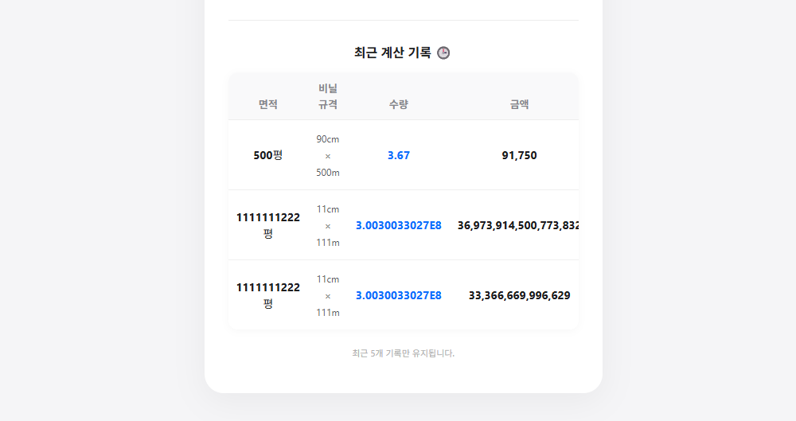

# 🚜 Farm Project

> **소개** > 실제 농업 현장에서 바로 사용할 수 있는 실용적인 프로그램을 모아 사용자에게 제공하는 웹 사이트입니다.

 

## 🛠️ 프로젝트 구성 (Configuration)

### 1. 기술 스택 (Tech Stack)
* **Backend**
    * **Language:** Java 21
    * **Framework:** Spring Boot 4.0.1
    * **Database:** MySQL
    * **Build Tool:** Gradle
    * **API Specs:** Swagger
    * **Test:** JUnit 5

* **Frontend**
    * **Language:** HTML5, CSS3, JavaScript
    * **Template Engine:** Thymeleaf
    * **Design & Tools:** Bootstrap 5, Gemini

### 2. 인프라 (Infrastructure)
* **Server:** Raspberry Pi 5 (RAM 4GB, Storage 128GB)
* **OS:** Linux
* **Network:** Cloudflare Tunnel
* **Domain:** Gavia

 

## 🚀 사용법 (Usage)

### 🏠 메인 사이트
* **URL:** [https://farm.wootae.com](https://farm.wootae.com)
* **API 명세서:** [https://farm.wootae.com/swagger-ui/index.html](https://farm.wootae.com/swagger-ui/index.html)

### 🧮 기능별 페이지
* **멀칭 비닐 계산기**
    * **URL:** [https://farm.wootae.com/mulchingFilmCalculator](https://farm.wootae.com/mulchingFilmCalculator)

 

## 🔄 버전 및 업데이트 정보 (Changelog)

### v.farm-0.0.3-SNAPSHOT (Current)
* **API 명세 구현:** Swagger 적용
* **테스트 코드 구현:** JUnit 5를 활용한 데이터 테스트 검증 완료

### v.farm-0.0.2-SNAPSHOT
* **사용자 피드백 반영 (Issue Resolved)**
    * 비닐 1롤당 면적 단위를 제곱미터($m^2$)에서 **'평'**으로 변경 요청 반영.
    * '1롤 커버'라는 모호한 용어를 **'한 롤당 멀칭 가능한 면적'**으로 수정하고 UI 정렬 개선.
* **사용자 편의성 개선 (UI/UX)**
    * 주 사용층(30~40대 이상)을 고려하여 인터페이스 가독성 증대.
    * 금액 표기 개선: 기존 숫자 나열(100000000) → **한글 단위 표기(1억 원)** 적용.
    * 단위 병행 표기: 1롤당 면적을 제곱미터와 평으로 함께 출력.
* **기능 추가 및 개선**
    * **히스토리 기능:** 이전 계산 데이터를 확인할 수 있도록 '최근 계산 조회' 기능 추가.
    * **대용량 처리:** 21억 이상의 큰 금액 처리를 위해 데이터 타입을 `long`으로 확장.

  

    

  

    

### v.farm-0.0.1-SNAPSHOT
* **최초 릴리즈:** 기본 계산 기능 구현

 

## 🐛 버그 및 디버그 (Known Issues)
* **단위 환산 표기 오류:** 멀칭 비닐 규격을 cm → m로 환산할 때, `0.5`와 같이 앞자리가 0인 경우 `.5`로 표기되는 현상 확인. (수정 예정)

 

## 👨‍💻 프로그래머 정보 (Developer)
* **GitHub:** [https://github.com/soraul2](https://github.com/soraul2)

 

## 📜 저작권 및 사용권 정보 (License)
* **사용권:** ALL
* **저작권:** Copyright ⓒ 2026 Kim Wootae. All rights reserved.

 

## ❓ FAQ
